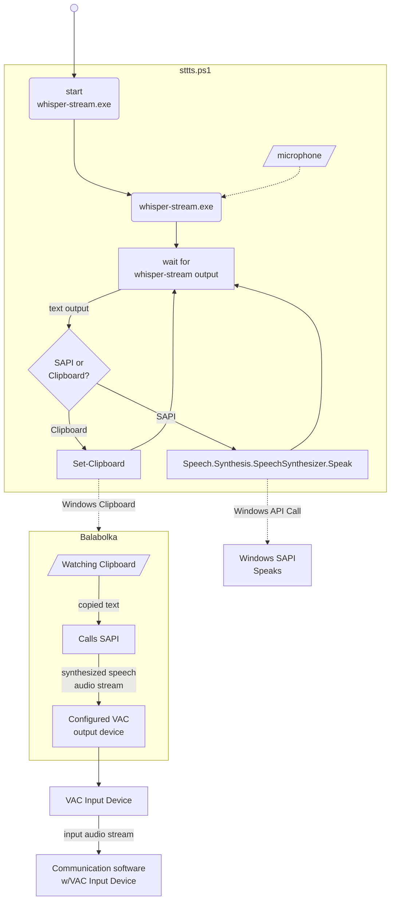

# STTTS

Speech To Text To Speech

A Powershell Script that invokes [whisper.cpp](https://github.com/ggml-org/whisper.cpp)'s `whisper-stream.exe` 
and sends the output to a speech synthetizer. Text captured from whisper-stream can be sent to the clipboard or
directly to Window's SAPI.

I wrote this script as an excercise in producing a command-line application based on PowerShell 7, and to help
a friend who suffers from anxiety issues after a traumatic event and prefers not to use real voice while
communicating through Discord, Teamspeak and similar voice-oriented communication software.

My user has already in place a small basic solution where using Balabolka and Virtual Audio Cable, voice sound
is produced by typing in [Balabolka](https://www.cross-plus-a.com/balabolka.htm) and sending the application's
output through VAC to TeamSpeak. STTTS helps by allowing the user to use a microphone to speak to the computer,
have an OpenAI whisper model transcribe that into text, and then STTTS sends that to Balabolka by copying the
text to the clipboard. Balabolka has a "Watch clipboard" mode where it detects changes in the clipboard and 
immediately speaks any text that is copied.


## Requirements

STTTS requires Powershell Core 7 to run. Follow 
[Microsoft's indications](https://learn.microsoft.com/powershell/scripting/install/install-powershell-on-windows) 
to install it.


## Installation

No installation necessary: just unzip the zipfile from the latest Release, open a Powershell session in the
extracted directory and run `stts.ps1` from there. `sttts.ps1` will download the `whisper.cpp` binaries as 
needed. Likewise, Whisper models will be downloaded automatically from huggingface the first time they are used.


## Usage

### sttts.cmd

This is the recommended invocation method for general usage. The `sttts.cmd` command script provides quality of 
life improvements when launching from the Windows GUI. If you run `sttts.cmd` from File Explorer or a shortcut
link you generate and launch from the Start Menu, it will check that you have PowerShell Core 7 installed, take 
care of ExecutionPolicy issues and add a pause at the end if there is an error so you can read the message before 
the console window closes.

### Customization

`sttts.cmd` passes through all of the arguments you give it to `sttts.ps1`, so you can customize your preferences
at any point where you invoke the command script, including shortcut links. Alternatively, you can store your
preferred arguments in the `STTTS_ARGS` environment variable, or edit `stts.cmd` and add your arguments where
`STTTS_ARGS` is assigned if not defined.

### Main Powershell script

Here are the parameters that `sttts.ps1` accepts (output of `sttts.ps1 -h`):

```
sttts.ps1 [-BinPath <string>] [-Gender <string>] [-Voice <string>] [-Rate <int>] [-Volume <int>] [-Lang <string>] [-Vth <float>] [-Model <string>] [<CommonParameters>]
sttts.ps1 -Clipboard [-BinPath <string>] [-Lang <string>] [-Vth <float>] [-Model <string>] [<CommonParameters>]
sttts.ps1 -ListVoices [-Lang <string>] [<CommonParameters>]
sttts.ps1 -ListModels [<CommonParameters>]
sttts.ps1 -Help [<CommonParameters>]

Parameters:

-BinPath      -b                  whisper-stream.exe location                                   Default: whisper\bin (Vanilla whisper)
-Clipboard    -c                  Send captured text to the clipboard
-Gender       -g                  Choose voice by gender                                        Default: (System's default voice synthethizer)
-Help         -h                  Show detailed help for each parameter and exit
-Lang         -l                  Let whisper know what language we are speaking into the mic   Default: auto (Automatic language recognition)
-ListModels                       List available whisper models and exit
-ListVoices                       List voice synthesizers available to the system and exit
-Model        -m                  Whisper model, will be downloaded if not found                Default: base-q5_1 (Base size quantized to 5bit with bias)
-Rate         -r                  Set voice speed rate (-10 to 10)                              Default: 0 (Normal speed)
-Voice        -n                  Choose voice by name (use -ListVoices for values)             Default: (System's default voice synthethizer)
-Volume       -v                  Set voice volume (0 to 100)                                   Default: 100 (Full volume)
-Vth                              Voice Activity Detection threshold
```

## Pipeline

Diagram of the whole chain:



## License

sttts is released under the GNU General Public License, version 3.

Copyright (C) 2025, Arturo Espinosa Aldama <pupitetris@yahoo.com>

See LICENSE.txt for the licensing terms under which this software is released.

    This program is free software: you can redistribute it and/or modify
    it under the terms of the GNU General Public License as published by
    the Free Software Foundation, either version 3 of the License, or
    (at your option) any later version.

    This program is distributed in the hope that it will be useful,
    but WITHOUT ANY WARRANTY; without even the implied warranty of
    MERCHANTABILITY or FITNESS FOR A PARTICULAR PURPOSE.  See the
    GNU General Public License for more details.
