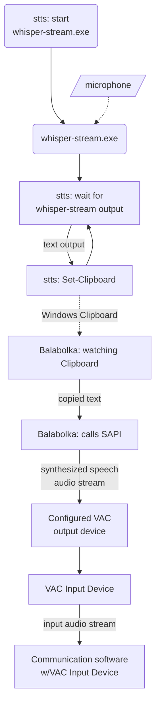

# STTTS

Speech To Text To Speech

A Powershell Script that invokes whisper.cpp's whisper-stream and sends the output to a speech synthetizer.
Text captured from whisper-stream can be sent to the clipboard or directly to Window's SAPI.

I wrote this script as an excercise in producing a command-line application based on PowerShell 7, and to help
a friend who suffers from anxiety issues after a traumatic event and prefers not to use real voice while
communicating through Discord, Teamspeak and similar voice-oriented communication software.

My user has already in place a small basic solution where using Balabolka and Virtual Audio Cable, voice sound
is produced by typing in Balabolka and sending the application's output through VAC to TeamSpeak. STTTS helps by
allowing the user to use a microphone to speak to the computer, have an OpenAI whisper model transcribe that
into text, and then STTTS sends that to Balabolka by copying the text to the clipboard. Balabolka has a "Watch
clipboard" mode where it detects changes in the clipboard and immediately speaks any text that is copied.

## Installation

No installation necessary: just unzip the zipfile from the latest Release, open a Powershell session in the
extracted directory and run `stts.ps1` from there. The release zipfile already contains all the needed binaries.
Whisper models will be downloaded automatically from huggingface the first time they are used.

## Usage

```
sttts.ps1 [-BinPath <string>] [-Gender <string>] [-Voice <string>] [-Rate <int>] [-Volume <int>] [-Lang <string>] [-Vth <float>] [-Model <string>] [<CommonParameters>]
sttts.ps1 -Clipboard [-BinPath <string>] [-Lang <string>] [-Vth <float>] [-Model <string>] [<CommonParameters>]
sttts.ps1 -ListVoices [-Lang <string>] [<CommonParameters>]
sttts.ps1 -ListModels [<CommonParameters>]
sttts.ps1 -Help [<CommonParameters>]

Parameters:

-BinPath      -b                  whisper-stream.exe location
-Clipboard    -c                  Send captured text to the clipboard
-Gender       -g                  Choose voice by gender
-Help         -h                  Show detailed help for each parameter
-Lang         -l                  Let whisper know what language we are speaking into the mic
-ListModels                       List available whisper models and exit
-ListVoices                       List voice synthesizers available to the system and exit
-Model        -m                  Whisper model, will be downloaded if not found
-Rate         -r                  Set voice speed rate (-10 to 10)
-Voice        -n                  Choose voice by name (use -ListVoices for values)
-Volume       -v                  Set voice volume (0 to 100)
-Vth                              Voice Activity Detection threshold
```

## Pipeline

Diagram of the whole chain:



## License

sttts is released under the GNU General Public License, version 3.

Copyright (C) 2025, Arturo Espinosa Aldama <pupitetris@yahoo.com>

See LICENSE.txt for the licensing terms under which this software is released.
